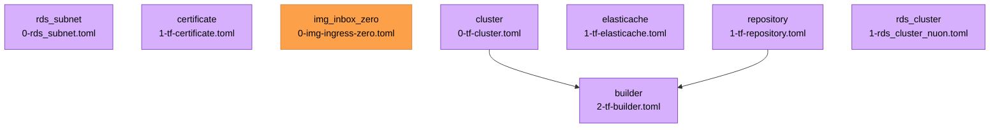

{{ $region := .nuon.cloud_account.aws.region }}

[!inbox-zero](https://github.com/elie222/inbox-zero/raw/main/apps/web/app/opengraph-image.png)

<h1>Inbox Zero</h1>

<small>
{{ if .nuon.install_stack.outputs }} AWS | {{ dig "account_id" "000000000000" .nuon.install_stack.outputs }} |
{{ dig "region" "xx-vvvv-00" .nuon.install_stack.outputs }} |
{{ dig "vpc_id" "vpc-000000" .nuon.install_stack.outputs }} {{ else }} AWS | 000000000000 | xx-vvvv-00 | vpc-000000
{{ end }}
</small>

[https://app.{{.nuon.sandbox.outputs.nuon_dns.public_domain.name}}](https://app.{{.nuon.sandbox.outputs.nuon_dns.public_domain.name}})

## Components

### Cluster

A simple ECS cluster with capacity for EC2 based services and Fargate services. We use Fargate to run the builder.

### Repository

ECR Repository for the inbox-zero container. Uses the registry created for the install by the sandbox. The versions of
the images in this repository can be listed using the `image` action. See the [`Inbox Zero Images`](#inboxzeroimages)
section below for a list of images that have been built and pushed to this repo.

### Builder

A Fargate ECS task with two stage.

1. git-clone: pulls the inbox-zero repo
2. kaniko: builds the image with the `NEXT_PUBLIC_BASE_URL` build arg.

This task is only active when explicitly created or invoked. This is done in an action, `builder`. Ideally, we'd watch
and wait for the task to finish.

## Actions

| Name    | Description                                         |
| ------- | --------------------------------------------------- |
| builder | creates a builder task on ECS to build the image.   |
| image   | gets a list of the image versions and their details |

### Inbox Zero Images

<!-- prettier-ignore-start -->
| Tag | Created At | Digest |
| --- | ---------- | ------ |
{{ range .nuon.actions.workflows.image.outputs.steps.list.images }}| {{ if .imageTags }}{{ index .imageTags 0 }}{{ else }}<none>{{ end }} | {{ .imagePushedAt }} | {{ .imageDigest }} |
{{ end }}
<!-- prettier-ignore-end -->

## Full State

Click "Manage > State"
